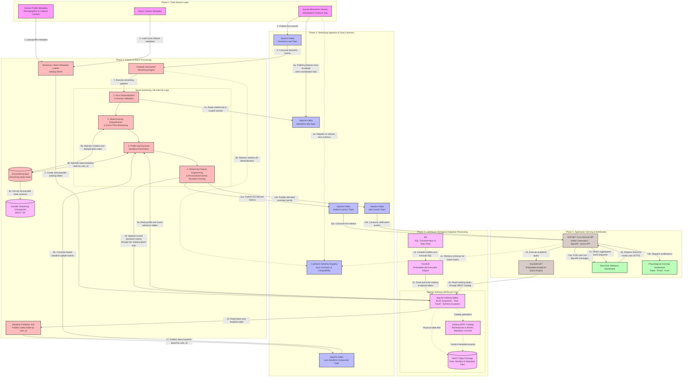
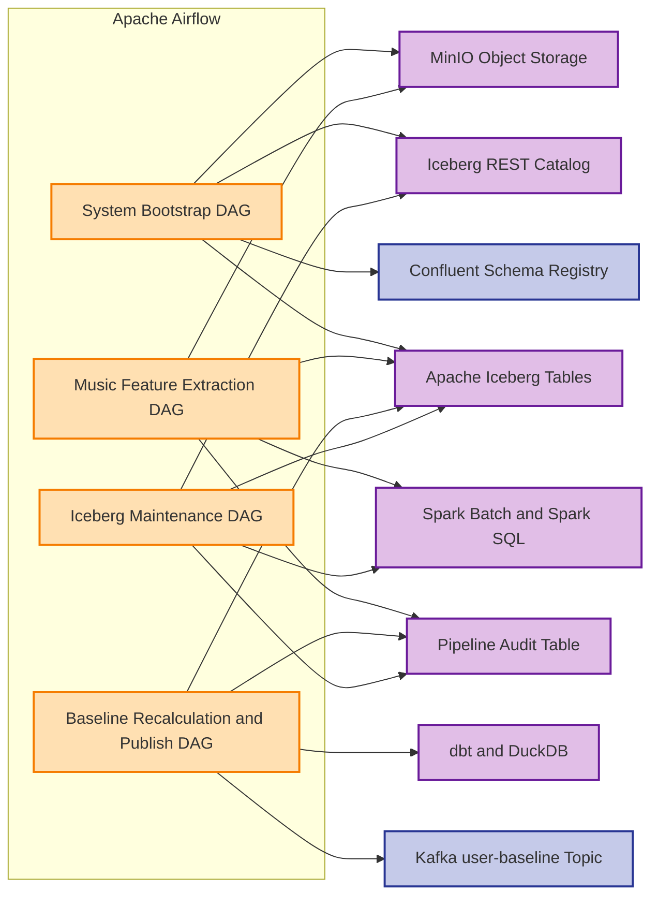
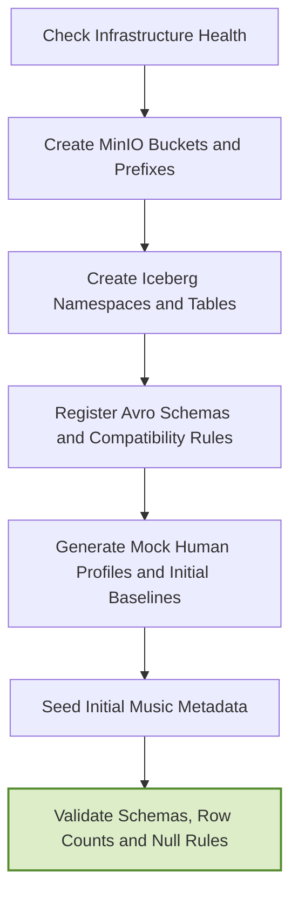
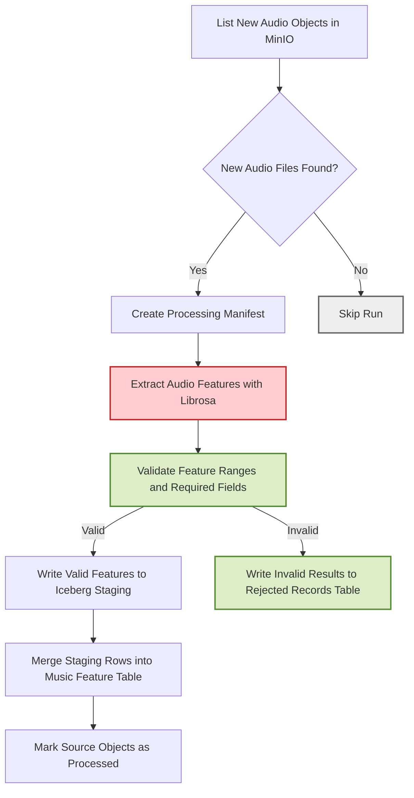
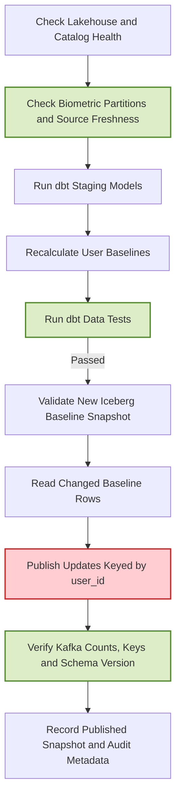
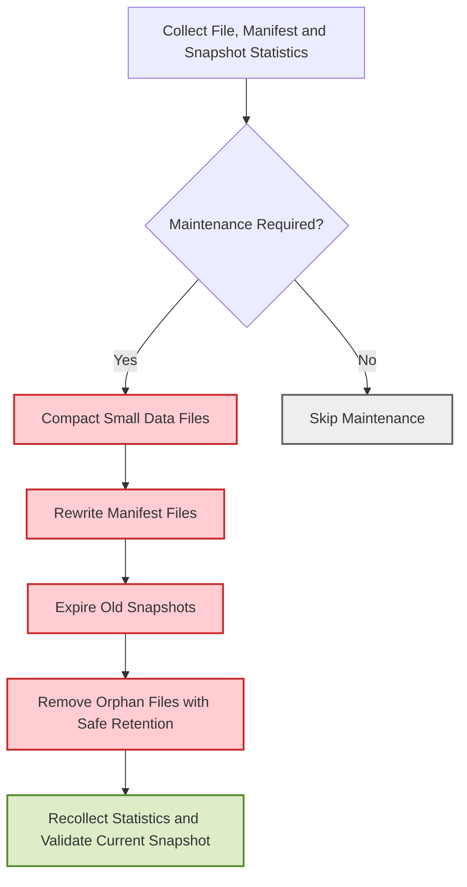
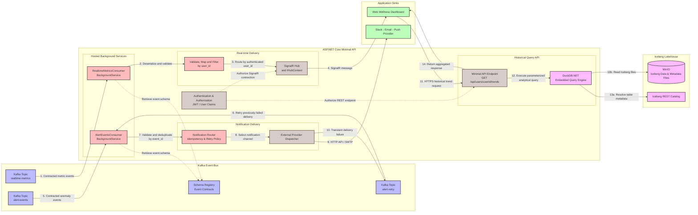

# Music Biometrics System Pipeline

## Pipeline Structure:



## Orchestrator Structure

Airflow orchestrates finite batch workflows only. The long-running Spark Structured Streaming application operates independently of Airflow.

### Orchestration Overview



### DAG 1: System Bootstrap

**Schedule:** Manual, one-time initialization.



Primary interactions:

- MinIO: create buckets and storage prefixes.
- Iceberg REST Catalog: create namespaces and tables.
- Schema Registry: register Avro schemas.
- Iceberg tables: seed profiles, baselines and music metadata.

### DAG 2: Automated Music Feature Extraction

**Schedule:** Periodic polling or event-triggered execution.



Idempotency key:

```text
object_key + object_etag + feature_version
```

The processing manifest should store the object key, ETag, processing status, feature version, timestamps and error details.

### DAG 3: Daily Baseline Recalculation and Publication

**Schedule:** Daily, after the previous day's biometric partitions are complete.



Data flow:

```text
Iceberg biometric tables
    -> dbt models executed by DuckDB
    -> Iceberg user baseline table
    -> baseline publisher job
    -> Kafka user-baseline compacted topic
    -> Spark Structured Streaming enrichment
```

The Kafka message key must be `user_id` so log compaction retains the latest baseline for each user.

### DAG 4: Iceberg Lakehouse Maintenance

**Schedule:** Daily for high-volume streaming tables and weekly for smaller reference tables.



Maintenance operations are executed through Spark SQL or Spark batch jobs:

```text
rewrite_data_files
rewrite_manifests
expire_snapshots
remove_orphan_files
```

A safe retention window must be used before removing orphan files to avoid deleting files belonging to an active or recently failed writer.


## Backend Structure:

