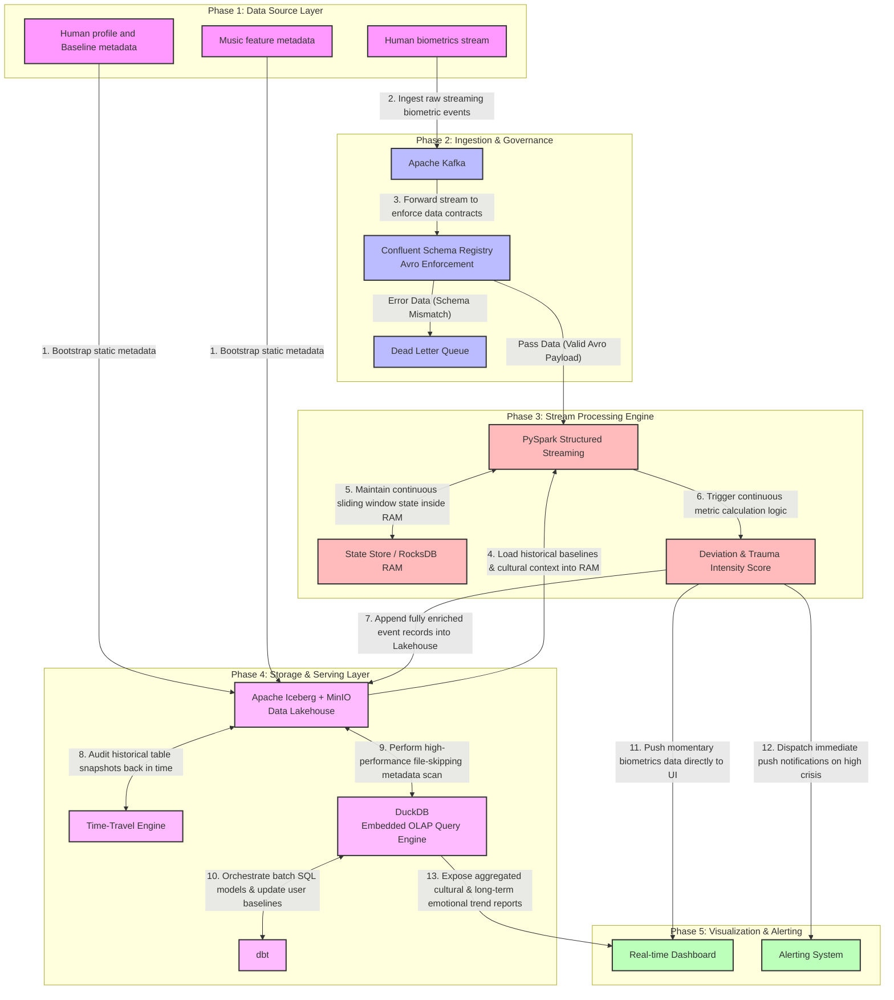

# Music Biometrics System Pipeline

## Pipeline Structure:

```mermaid
graph TD
    %% Define Styles for Architecture Layers
    classDef source fill:#f9f,stroke:#333,stroke-width:2px;
    classDef ingest fill:#bbf,stroke:#333,stroke-width:2px;
    classDef process fill:#fbb,stroke:#333,stroke-width:2px;
    classDef store fill:#fbf,stroke:#333,stroke-width:2px;
    classDef view fill:#bfb,stroke:#333,stroke-width:2px;

    %% Phase 1: Data Source Layer
    subgraph P1 [Phase 1: Data Source Layer]
        A1[Human biometrics stream]:::source
        A2[Human profile and Baseline metadata]:::source
        A3[Music feature metadata]:::source
    end

    %% Phase 2: Ingestion & Governance Layer
    subgraph P2 [Phase 2: Ingestion & Governance]
        B1[Apache Kafka]:::ingest
        B2[Confluent Schema Registry<br>Avro Enforcement]:::ingest
        B3[Dead Letter Queue]:::ingest
    end
    
    %% Phase 3: Stream Processing Engine
    subgraph P3 [Phase 3: Stream Processing Engine]
        C1[PySpark Structured Streaming]:::process
        C2[State Store / RocksDB RAM]:::process
        C3[Deviation & Trauma Intensity Score]:::process
    end

    %% Phase 4: Storage & Serving Layer
    subgraph P4 [Phase 4: Storage & Serving Layer]
        D1[Apache Iceberg + MinIO<br>Data Lakehouse]:::store
        D2[Time-Travel Engine]:::store
        D3[DuckDB<br>Embedded OLAP Query Engine]:::store
        D4[dbt]:::store
    end

    %% Phase 5: Visualization & Alerting Layer
    subgraph P5 [Phase 5: Visualization & Alerting]
        E1[Real-time Dashboard]:::view
        E2[Alerting System]:::view
    end
    
    %% --- END-TO-END DATA PIPELINE FLOWS WITH ENGLISH LABELS ---
    
    A2 & A3 -->|1. Bootstrap static metadata| D1

    A1 -->|2. Ingest raw streaming biometric events| B1
    B1 -->|3. Forward stream to enforce data contracts| B2
    B2 -- "Error Data (Schema Mismatch)" --> B3
    B2 -- "Pass Data (Valid Avro Payload)" ---> C1

    D1 -->|4. Load historical baselines & cultural context into RAM| C1
    C1 <-->|5. Maintain continuous sliding window state inside RAM| C2
    C1 -->|6. Trigger continuous metric calculation logic| C3

    C3 -->|7. Append fully enriched event records into Lakehouse| D1
    D1 <-->|8. Audit historical table snapshots back in time| D2
    D1 <-->|9. Perform high-performance file-skipping metadata scan| D3
    D3 <-->|10. Orchestrate batch SQL models & update user baselines| D4

    C3 -->|11. Push momentary biometrics data directly to UI| E1
    C3 -->|12. Dispatch immediate push notifications on high crisis| E2
    D3 -->|13. Expose aggregated cultural & long-term emotional trend reports| E1
```

