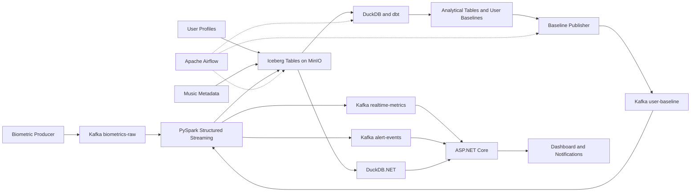

# Music Biometrics Data Platform

An end-to-end data engineering project that processes simulated biometric events, enriches them with user and music metadata, stores historical data in an Apache Iceberg lakehouse, and serves real-time and historical insights through an ASP.NET Core backend.

The goal is to demonstrate a complete data flow using streaming, lakehouse storage, batch transformation, orchestration, data quality, and application serving.

---

## 1. Project Goals

The platform will:

1. Generate simulated biometric events.
2. Ingest streaming events through Apache Kafka.
3. Process and enrich events with PySpark Structured Streaming.
4. Store historical data in Apache Iceberg tables on MinIO.
5. Build analytical models and user baselines with dbt and DuckDB.
6. Publish updated baselines back to Kafka.
7. Serve live and historical data through ASP.NET Core.
8. Orchestrate batch workflows with Apache Airflow.

> This is a portfolio project and does not provide medical diagnosis.

---

## 2. Data Sources

The project starts with three base datasets.

### Biometric Events

Simulated real-time human data.
For more information: [Docs: Data Dictionary](docs/data_dictionary.md)

```text
event_id            -- String(UUID)
user_id             -- String(UUID)
timestamp           -- Long(epoch ms)
heart_rate          -- Double
hrv_rmssd           -- Double
eda_microsiemens    -- Double
motion_status       -- String
```

### User Profile Metadata

Static information used to enrich biometric events. \
For more information: [Docs: Data Dictionary](docs/data_dictionary.md)

```text
user_id                 -- string(UUID)
username                -- string
dob                     -- Date
gender                  -- String
cultural_region         -- String
baseline_resting_hr     -- Double
baseline_hrv_sdnn       -- Double
created_at              -- Timestamp
updated_at              -- Timestamp
```

### Music Metadata

Static or batch-generated track information. \
For more information: [Docs: Data Dictionary](docs/data_dictionary.md)

```text
track_id            -- String
track_title         -- String
artist              -- String
genre               -- String
language_code       -- String

tempo_bpm           -- Double
energy_rms          -- Double
spectral_flatness   -- Double
danceability_proxy  -- Double
instrumentalness    -- Double

music_valence       -- Double
lyrics_theme        -- String
lyrics_sentiment    -- Double
granular_mood       -- String
```

---

## 3. Technology Stack

| Layer               | Technologies                         |
|:--------------------|:-------------------------------------|
| Infrastructure      | Docker, Docker Compose               |
| Streaming ingestion | Apache Kafka                         |
| Data contracts      | Avro, Confluent Schema Registry      |
| Stream processing   | PySpark Structured Streaming         |
| Streaming state     | RocksDB-backed state store           |
| Object storage      | MinIO                                |
| Table format        | Apache Iceberg                       |
| Catalog             | Iceberg REST Catalog                 |
| Batch analytics     | DuckDB                               |
| Data transformation | dbt                                  |
| Orchestration       | Apache Airflow                       |
| Backend             | ASP.NET Core Minimal API             |
| Real-time delivery  | SignalR                              |
| Testing             | Pytest, dbt tests, integration tests |

---

## 4. High-Level Data Flow



---

## 5. Core Data Flow

### Static Data Loading

```text
User Profiles ─┐
               ├─> Bootstrap Loader ─> Iceberg Tables on MinIO
Music Metadata ┘
```

### Real-Time Biometric Pipeline

```text
Mock Smartwatch Producer
    -> Avro
    -> Kafka biometrics-raw
    -> PySpark Structured Streaming
    -> Validation and Enrichment
    -> Iceberg scored_biometric_events
```

Spark will:

- Deserialize Avro records.
- Validate required fields.
- Route invalid records to a DLQ.
- Remove duplicates.
- Process event-time windows.
- Enrich events with user and baseline data.
- Calculate simple deviation metrics.
- Write valid results to Iceberg.

### Lakehouse Storage

```text
Spark
    -> Apache Iceberg Tables
    -> MinIO Object Storage
```

Iceberg manages schemas, snapshots, metadata, time travel, and atomic commits. MinIO stores Parquet, manifest, metadata, and checkpoint files.

### Batch Analytics

```text
Iceberg Tables
    -> DuckDB
    -> dbt Models and Tests
    -> Daily Metrics
    -> User Baselines
```

dbt models:

```text
stg_biometric_events
stg_user_profiles
int_daily_user_metrics
fct_daily_wellness
user_baselines
```

### Baseline Feedback Loop

```text
Iceberg user_baselines
    -> Baseline Publisher
    -> Kafka user-baseline
    -> Spark enrichment
```

The Kafka message key should be `user_id`.

### Backend Serving

Real-time flow:

```text
Spark
    -> Kafka realtime-metrics
    -> ASP.NET Core BackgroundService
    -> SignalR
    -> Dashboard
```

Historical flow:

```text
Dashboard
    -> ASP.NET Core API
    -> DuckDB.NET
    -> Iceberg Tables
```

### Airflow Orchestration

Airflow orchestrates batch workflows only. Spark Structured Streaming runs independently.

Initial DAGs:

```text
System Bootstrap DAG
Daily Baseline Recalculation DAG
```

Optional DAGs:

```text
Music Feature Extraction DAG
Iceberg Maintenance DAG
```

---

## 6. Kafka Topics

| Topic               | Purpose                  | Message Key |
|:--------------------|:-------------------------|:------------|
| `biometrics_stream` | Raw biometric events     | `user_id`   |
| `biometrics_dlq`    | Invalid events           | `event_id`  |
| `user_baseline`     | Latest baseline per user | `user_id`   |
| `realtime_metrics`  | Live metrics for backend | `user_id`   |
| `alert_events`      | Elevated anomaly events  | `user_id`   |
| `alert_retry`       | Notification retries     | `event_id`  |

MVP topics:

```text
biometrics_stream
biometrics_dlq
user_baseline
realtime_metrics
```

---

## 7. Main Iceberg Tables

| Table                     | Purpose                                  |
|:--------------------------|:-----------------------------------------|
| `user_profiles`           | User profile and default baseline data   |
| `music_tracks`            | Music metadata and features              |
| `raw_biometric_events`    | Validated raw events                     |
| `scored_biometric_events` | Enriched events and calculated metrics   |
| `daily_user_metrics`      | Daily aggregated metrics                 |
| `user_baselines`          | Latest calculated baseline per user      |
| `pipeline_audit`          | Batch execution and publication metadata |

MVP tables:

```text
user_profiles
music_tracks
scored_biometric_events
user_baselines
```

---

## 8. Implementation Roadmap

### Phase 1 — Infrastructure

Set up Kafka, Schema Registry, MinIO, Iceberg REST Catalog, and Docker Compose.

**Done when:** all core services start successfully.

### Phase 2 — Base Data

Create sample user profiles, music metadata, a bootstrap loader, and initial Iceberg tables.

**Done when:** user and music tables can be queried from Iceberg.

### Phase 3 — Kafka Producer

Create the mock biometric generator, Avro schema, Kafka producer, and basic tests.

**Done when:** biometric events are continuously published to `biometrics-raw`.

### Phase 4 — Spark Streaming

Implement Kafka input, Avro deserialization, validation, DLQ handling, deduplication, simple scoring, and checkpointing.

**Done when:** Kafka events are processed continuously by Spark.

### Phase 5 — Iceberg Output

Create `scored_biometric_events`, configure the Spark Iceberg sink, and verify snapshots.

**Done when:** processed events are queryable from Iceberg.

### Phase 6 — dbt and DuckDB

Create staging models, daily aggregates, user baselines, and dbt tests.

**Done when:** `dbt build` succeeds and creates `user_baselines`.

### Phase 7 — Baseline Feedback

Create the baseline publisher, compacted Kafka topic, Spark baseline consumer, and baseline version tracking.

**Done when:** Spark receives updated baselines without restarting.

### Phase 8 — Backend

Create the ASP.NET Core Minimal API, Kafka consumer, SignalR hub, historical endpoint, and simple dashboard.

**Done when:** the dashboard displays live and historical metrics.

### Phase 9 — Airflow

Create the bootstrap DAG and daily baseline DAG with retries and audit logging.

**Done when:** Airflow runs the full batch baseline workflow.

### Phase 10 — Reliability and Documentation

Add tests, DLQ demonstrations, restart tests, logging, screenshots, setup instructions, and a demo.

**Done when:** another developer can understand and start the repository.

---

## 9. Repository Structure

```text
Music_Biometrics/
├── infrastructure/
│   └── docker-compose.yml
├── data/
│   ├── user_profiles/
│   └── music_metadata/
├── producer/
├── streaming/
├── batch/
├── dbt/
├── airflow/
├── backend/
├── dashboard/
├── tests/
├── docs/
└── README.md
```

---

## 10. Completion Checklist

### Infrastructure

- [x] Kafka starts successfully.
- [x] Schema Registry is available.
- [x] MinIO is available.
- [x] Iceberg REST Catalog is available.

### Data Sources

- [x] User profile sample data exists.
- [x] Music metadata sample data exists.
- [x] Biometric producer generates valid events.

### Streaming

- [ ] Spark reads from Kafka.
- [ ] Spark validates records.
- [ ] Invalid records go to the DLQ.
- [ ] Spark checkpointing works.
- [ ] Processed events are stored in Iceberg.

### Analytics

- [ ] DuckDB can query Iceberg tables.
- [ ] dbt models run successfully.
- [ ] dbt tests pass.
- [ ] User baselines are generated.

### Feedback Loop

- [ ] Baselines are published to Kafka.
- [ ] Spark consumes baseline updates.
- [ ] Scored events contain a baseline version.

### Serving

- [ ] Backend consumes real-time metrics.
- [ ] SignalR sends live updates.
- [ ] Historical API returns trend data.

### Orchestration

- [ ] Bootstrap DAG works.
- [ ] Daily baseline DAG works.
- [ ] Failed tests stop baseline publication.
- [ ] Audit metadata is stored.

### Portfolio

- [ ] Docker Compose setup is documented.
- [ ] Architecture diagram matches the code.
- [ ] Screenshots are included.
- [ ] Demo steps are documented.
- [ ] Limitations and future improvements are stated.

---

## 11. Final Target Flow

```text
User Profiles ───────────────┐
                             ├─> Iceberg Tables on MinIO
Music Metadata ──────────────┘

Biometric Producer
    -> Kafka
    -> Spark Structured Streaming
    -> Validation and Enrichment
    -> Iceberg Tables on MinIO

Iceberg
    -> DuckDB
    -> dbt
    -> Daily Metrics and User Baselines

User Baselines
    -> Baseline Publisher
    -> Kafka user-baseline
    -> Spark Enrichment

Spark
    -> Kafka realtime-metrics
    -> ASP.NET Core
    -> Dashboard

Airflow
    -> Bootstrap
    -> dbt Baseline Workflow
    -> Baseline Publication
    -> Optional Maintenance
```

---

## 12. Future Improvements

- There will be something interesting here after I finish the above section. Maybe ... ?