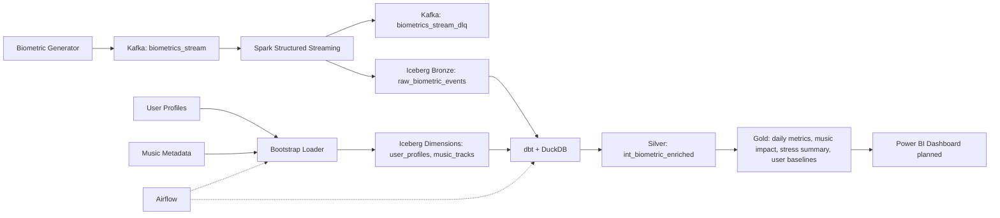
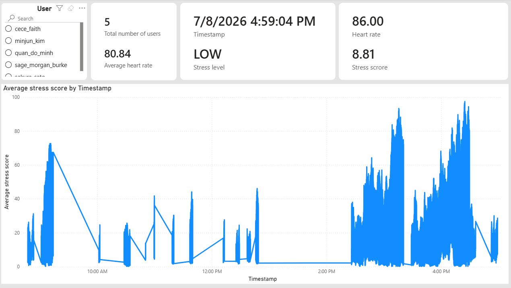
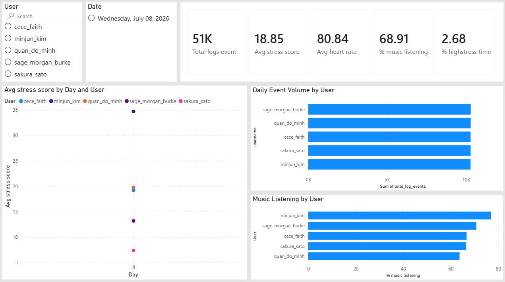
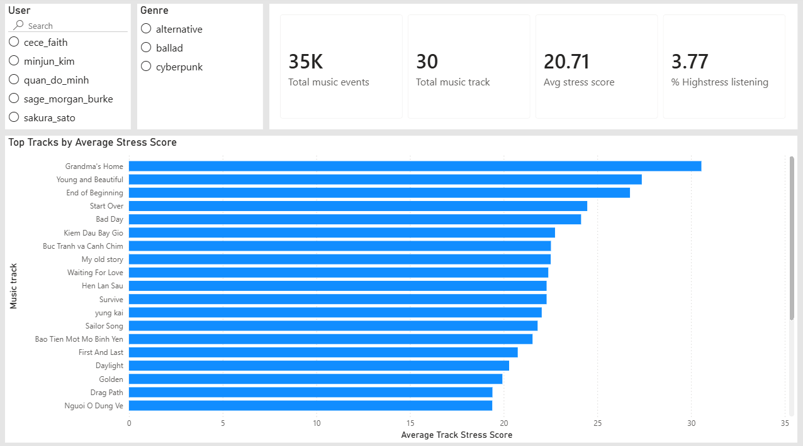

# Music Biometrics Data Platform

An end-to-end data engineering portfolio project that simulates wearable biometric events, ingests them through Kafka, stores validated streaming data in an Apache Iceberg lakehouse, transforms the data with dbt/DuckDB, orchestrates batch workflows with Airflow, and prepares Gold-layer datasets for a Power BI dashboard.

The project focuses on a lakehouse-style ELT architecture:

```text
Kafka -> PySpark Structured Streaming -> Iceberg Bronze
Iceberg Bronze -> dbt/DuckDB Silver and Gold models
Airflow -> dbt orchestration
Power BI -> dashboard from Gold tables
```

> This is a portfolio project using simulated data. It does not provide medical diagnosis or health advice.

---

## 1. Project Goals

The platform demonstrates how to:

1. Generate simulated biometric events with optional music-listening context.
2. Publish Avro events to Kafka with Schema Registry.
3. Process streaming events with PySpark Structured Streaming.
4. Store validated event data in Apache Iceberg tables on MinIO.
5. Build Bronze, Silver, and Gold analytical models with dbt and DuckDB.
6. Generate user baselines and music-impact metrics.
7. Orchestrate bootstrap and daily ELT workflows with Apache Airflow.
8. Visualize Gold tables in Power BI.

---

## 2. Current Status

Implemented:

- Docker Compose infrastructure for Kafka, Schema Registry, MinIO, Iceberg REST Catalog, Postgres catalog DB, Spark worker, generator, bootstrap loader, and Airflow.
- Simulated biometric generator with `track_id` support.
- Kafka Avro producer and Schema Registry integration.
- Spark Structured Streaming worker for Kafka input, Avro deserialization, validation, deduplication, DLQ handling, checkpointing, and Iceberg output.
- Bootstrap loader for user profiles and music metadata.
- dbt staging, intermediate enrichment, Gold metrics, user baselines, and dbt tests.
- Airflow DAGs for lakehouse bootstrap and daily dbt pipeline orchestration.
- Power BI dashboard from Gold-layer outputs.

Planned:
- Optional backend/API layer later.

---

## 3. Data Sources

### Biometric Events

Simulated real-time wearable events.

```text
event_id            -- String(UUID)
user_id             -- String(UUID)
track_id            -- String, nullable
timestamp           -- Long(epoch ms)
heart_rate          -- Double
hrv_rmssd           -- Double
eda_microsiemens    -- Double
motion_status       -- String
event_time          -- Timestamp, derived by Spark
```

`track_id` is nullable. A null `track_id` means the simulated user is not listening to music at that moment.

### User Profile Metadata

Static user profile and initial baseline data.

```text
user_id                 -- String(UUID)
username                -- String
dob                     -- Date
gender                  -- String
cultural_region         -- String
baseline_resting_hr     -- Double
baseline_hrv_sdnn       -- Double
created_at              -- Timestamp
updated_at              -- Timestamp
```

### Music Metadata

Static music metadata used for enrichment.

```text
track_id            -- String
track_title         -- String
artist              -- String
genre               -- String
language_code       -- String

tempo_bpm           -- Double
energy_rms          -- Double
spectral_flatness   -- Double
danceability_proxy  -- Double
instrumentalness    -- Double

music_valence       -- Double
lyrics_theme        -- String
lyrics_sentiment    -- Double
granular_mood       -- String
```

---

## 4. Technology Stack

| Layer               | Technologies                     |
|:--------------------|:---------------------------------|
| Infrastructure      | Docker, Docker Compose, Makefile |
| Streaming ingestion | Apache Kafka                     |
| Data contracts      | Avro, Confluent Schema Registry  |
| Stream processing   | PySpark Structured Streaming     |
| Object storage      | MinIO                            |
| Table format        | Apache Iceberg                   |
| Catalog             | Iceberg REST Catalog, Postgres   |
| Batch analytics     | DuckDB                           |
| Transformation      | dbt                              |
| Orchestration       | Apache Airflow                   |
| BI / Serving        | Power BI planned                 |
| Testing             | dbt tests                        |

---

## 5. Architecture



---

## 6. Core Data Flow

### Static Data Loading

```text
sample_data/user_profiles.parquet
sample_data/music_metadata.parquet
        -> Bootstrap Loader
        -> Iceberg tables: user_profiles, music_tracks
```

### Streaming Pipeline

```text
Biometric Generator
    -> Avro
    -> Kafka biometrics_stream
    -> Spark Structured Streaming
    -> validation, deduplication, event-time handling
    -> Kafka biometrics_stream_dlq for invalid events
    -> Iceberg raw_biometric_events
```

Spark is responsible for:

- Reading Kafka events.
- Deserializing Avro payloads.
- Validating required biometric fields.
- Routing invalid records to the DLQ.
- Deduplicating by `event_id`.
- Creating `event_time` from epoch milliseconds.
- Writing valid events to Iceberg.
- Maintaining checkpoint state in MinIO.

### ELT Analytics

```text
Iceberg raw_biometric_events
    + user_profiles
    + music_tracks
    -> dbt staging
    -> dbt silver enrichment
    -> dbt gold metrics and baselines
```

dbt is responsible for:

- Cleaning and standardizing source columns.
- Joining biometric events with user metadata.
- Joining music metadata when `track_id` is available.
- Creating `is_listening_music`.
- Calculating baseline deviations and stress score.
- Building Gold-layer user, music, and baseline metrics.
- Running dbt tests.

---

## 7. Kafka Topics

| Topic                   | Purpose                  | Message Key |
|:------------------------|:-------------------------|:------------|
| `biometrics_stream`     | Raw biometric events     | `user_id`   |
| `biometrics_stream_dlq` | Invalid biometric events | `event_id`  |

Optional/future topics:

| Topic              | Purpose                  | Message Key |
|:-------------------|:-------------------------|:------------|
| `user_baseline`    | Latest baseline per user | `user_id`   |
| `realtime_metrics` | Live dashboard metrics   | `user_id`   |
| `alert_events`     | Alert or anomaly events  | `user_id`   |

---

## 8. Iceberg Tables and dbt Models

### Raw / Dimension Tables

| Table                   | Purpose                                       |
|:------------------------|:----------------------------------------------|
| `user_profiles`         | Static user profile and initial baseline data |
| `music_tracks`          | Static music metadata                         |
| `raw_biometric_events`  | Validated streaming biometric events          |

### dbt Models

```text
staging:
- stg_biometric_events
- stg_user_profiles
- stg_music_tracks

silver:
- int_biometric_enriched

gold:
- gold_daily_user_metrics
- gold_music_impact_metrics
- gold_user_stress_summary
- user_baselines
```

### Gold Output Purpose

| Model                       | Purpose                                                                   |
|:----------------------------|:--------------------------------------------------------------------------|
| `gold_daily_user_metrics`   | Daily metrics per user                                                    |
| `gold_music_impact_metrics` | Track-level biometric and stress response metrics during listening events |
| `gold_user_stress_summary`  | User-level stress and biometric summary                                   |
| `user_baselines`            | Static vs dynamic baseline comparison and effective user baseline         |

---

## 9. Airflow DAGs

| DAG                           | Purpose                                                             |
|:------------------------------|:--------------------------------------------------------------------|
| `01_bootstrap_lakehouse`      | Initializes base Iceberg dimension tables and validates dbt staging |
| `02_daily_biometric_pipeline` | Runs the daily dbt build for Silver and Gold models                 |

Airflow orchestrates batch ELT workflows only. Spark Structured Streaming runs as an independent long-running service.

---

## 10. Local Run Commands

### Start the platform

```bash
make up
```

### Start Airflow

```bash
make airflow
```

### Stop services

```bash
make down
```

### Reset all Docker volumes

```bash
make clean
```

---

## 11. Implementation Roadmap

### Phase 1 — Infrastructure

Set up Kafka, Schema Registry, MinIO, Iceberg REST Catalog, Postgres catalog DB, and Docker Compose.

**Done when:** all core services start successfully.

### Phase 2 — Base Data

Create sample user profiles, music metadata, a bootstrap loader, and initial Iceberg dimension tables.

**Done when:** user and music tables can be queried from Iceberg.

### Phase 3 — Kafka Producer

Create the mock biometric generator, Avro schema, and Kafka producer.

**Done when:** biometric events are continuously published to `biometrics_stream`.

### Phase 4 — Spark Streaming

Implement Kafka input, Avro deserialization, validation, DLQ handling, deduplication, and checkpointing.

**Done when:** Kafka events are processed continuously by Spark.

### Phase 5 — Iceberg Bronze Output

Create `raw_biometric_events` and configure the Spark Iceberg sink.

**Done when:** processed streaming events are queryable from Iceberg.

### Phase 6 — dbt and DuckDB ELT

Create staging models, Silver enrichment, Gold metrics, user baselines, and dbt tests.

**Done when:** `dbt build` succeeds and creates the Gold models and `user_baselines`.

### Phase 7 — Airflow Orchestration

Create bootstrap and daily pipeline DAGs with retries and dbt execution.

**Done when:** Airflow can run the bootstrap and daily dbt workflows.

### Phase 8 — Power BI Dashboard

Create a dashboard from Gold tables.

**Done when:** Power BI visualizes daily user metrics, music impact metrics, user stress summary, and user baselines.

---

## 12. Completion Checklist

### Infrastructure

- [x] Kafka starts successfully.
- [x] Schema Registry is available.
- [x] MinIO is available.
- [x] Iceberg REST Catalog is available.
- [x] Docker Compose / Makefile workflow is available.

### Data Sources

- [x] User profile sample data exists.
- [x] Music metadata sample data exists.
- [x] Biometric producer generates valid events with optional `track_id`.

### Streaming

- [x] Spark reads from Kafka.
- [x] Spark deserializes Avro records.
- [x] Spark validates records.
- [x] Invalid records go to the DLQ.
- [x] Spark checkpointing works.
- [x] Valid events are stored in Iceberg.

### Analytics

- [x] dbt staging models are defined.
- [x] Silver enrichment model is defined.
- [x] Gold metrics are defined.
- [x] User baselines are generated.
- [x] dbt tests are defined.

### Orchestration

- [x] Bootstrap DAG is defined.
- [x] Daily dbt pipeline DAG is defined.

### BI / Serving

- [x] Power BI dashboard is built.
- [x] Dashboard screenshots are added to documentation.

---

## 13. Notes and Limitations

- The biometric and music data are simulated.
- Stress scoring is rule-based and used for data engineering demonstration only.
- The project does not provide medical diagnosis.
- Backend/API serving is optional future work.

---

## 14. Power BI Dashboard

### Near Real-Time User Stress Monitoring



### Daily User Metrics



### Music Impact Metrics

